# Snowflake SnowConvert, Migration from SQL Server to Snowflake HOL

## Step 0: Prerequisites

To run through this lab, you need the following resources:

- SnowConvert - Follow the steps below to download SnowConvert from inside your demo account:
  

- [Snowflake VS Code Extension](https://docs.snowflake.com/en/user-guide/vscode-ext)

Both of these will run on your local machine. There are settings you will have to change to ensure everything runs correctly, but that will all be detailed in the walkthrough below.

> **Important Note**: This lab uses GenAI, which can produce different results each time, potentially leading to varied errors and solutions. This document addresses common issues, but Cortex-generated code may differ slightly and suggest alternative troubleshooting steps. Remember, you have the necessary skills to resolve any errors and successfully complete the migration. Don't be concerned if your errors or code differ; this is expected with GenAI. Ensure all errors are resolved to successfully migrate data to your Snowflake environment and receive credit.

---

## Step 1: Project Creation

We have an adventure works database in SQL Server, and we have some spark scripts that load data into the sql server. The customer wants to move all of this into Snowflake.

Open SnowConvert

You might receive this message when you try to open SnowConvert for the first time:


If you do please follow the [directions in the FAQ](https://docs.snowconvert.com/sc/general/frequently-asked-questions-faq#how-do-i-give-permission-to-snowconvert-config-folder) to resolve this issue.

When you open the application it may prompt you to update it, if an update is available please update the application:

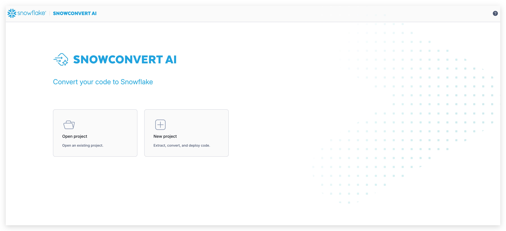

Go ahead and update the tool if needed. When working with the application, it is generally better to keep it as up to date as possible. This is a local application. Keeping it up to date not only ensures the functionality of the application, but also ensures that you have the most up to date version of the conversion core.

Create a new folder in your Documents folder (or wherever you want so it is separate and accessible) on your machine called 'Snowconvert'

Going back to SnowConvert Select New Project.

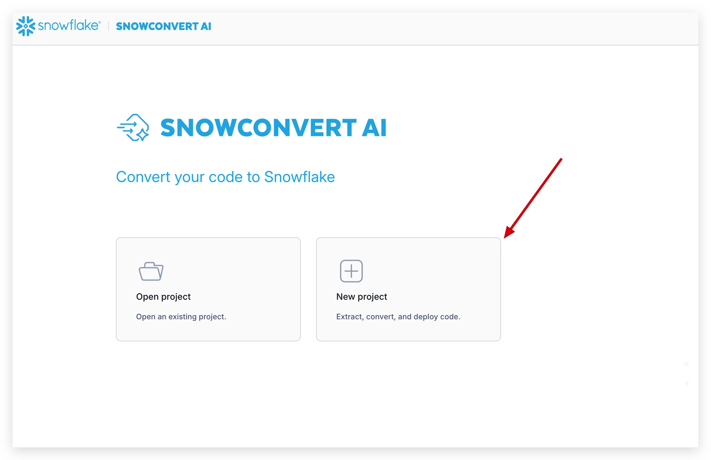

To begin using any version of SnowConvert, you will need to create a project. Think of a project as a local config file that will be saved to your machine. This will preserve any settings and will allow you to continue where you left off if you need to step away.

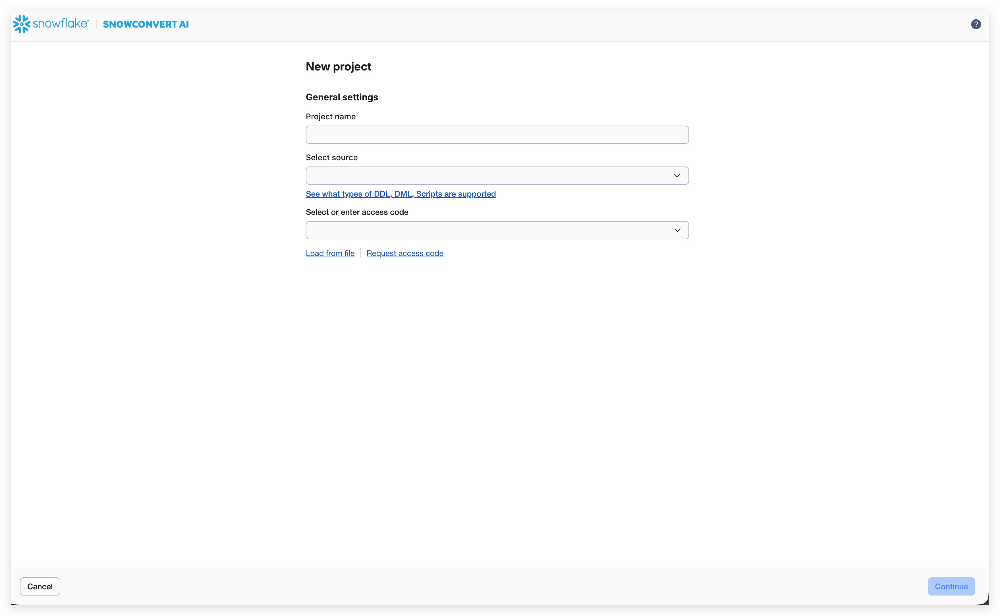

Let's call our project: **SQL Server ADW Test**

We then need to select a source. In this case, it is SQL Server.

To run any element of a project in SnowConvert, you will need to provide an access code. Unless you have used SnowConvert before, you will need an access code. Happily, you can request access in the tool by selecting "Get an access code" next to the access code drop down.

>Note that if you have already activated an access code, you will see options in the dropdown menu in the license screen as shown here:

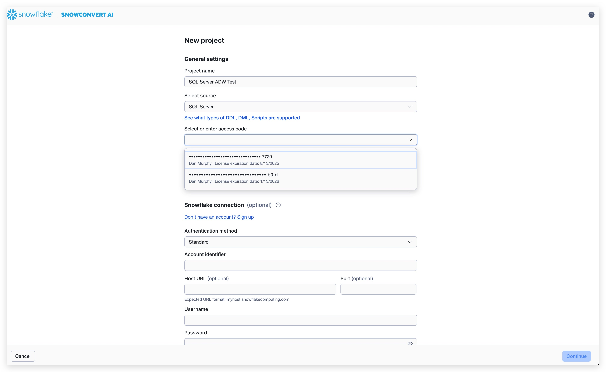

Assuming we do not yet have an access code, let's request an access code. Choose "Request access code" from the hyperlinks under the dropdown for access code. When you do this, the access code form will pop up:


This information is needed to confirm who you are to Snowflake. Once you complete the form, you will receive an email with an access code. It will look something like this:


Paste this access code into the application where it says "Enter new access code or select one" in SnowConvert. When your access code has been accepted, you will get a small message under the dropdown menu that says "Access code activated successfully".


You will need to have an active internet connection in order to activate your access code. If you are unable to activate your access code, check out [the troubleshooting section](https://docs.snowconvert.com/sc/general/frequently-asked-questions-faq#why-am-i-not-receiving-an-access-code) of the SnowConvert documentation.

### Add Snowflake Connectivity Information
After entering your access code you can then  put in your Snowflake Connectivity which will be used for later when you push the data to Snowflake.

>You will need to connect to one of the **RTF labeled VPN's**, this will enable full tunneling which is needed to get to the SQL Server we have for this lab.  With the RTF you will also be able to still connect to your Snowflake Demo account based on the VPN security requirement we have for SE Demo account
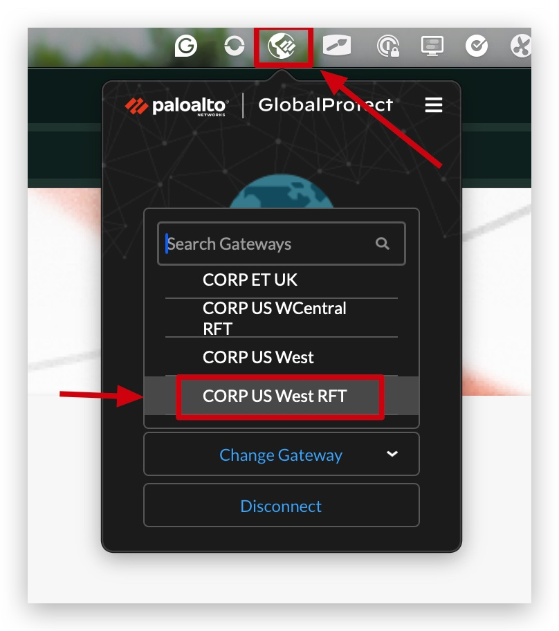

Log into your Snowflake account and run the below SQL to give you the correct permissions as well as create a database and create a warehouse for this lab:
```sql
--elevate privledges to grant a migration privledge to your role
use role accountadmin;

--grant migration privledge
grant create migration on account to role sysadmin;

--use a non admin role for best practices
use role sysadmin;

--create a database as a landing zone for the migration
Create or replace database AdventureWorks;

CREATE OR REPLACE WAREHOUSE medium 
WITH 
    WAREHOUSE_SIZE = 'MEDIUM'
    AUTO_SUSPEND = 300
    AUTO_RESUME = TRUE;
```

Then complete the rest of the Snowconvert New Project page with your Snowflake Connection information which is easily accessible in your demo account under 'Connect a Tool to Snowflake'.  **Be ready for MFA authentication** when you click Test Connection

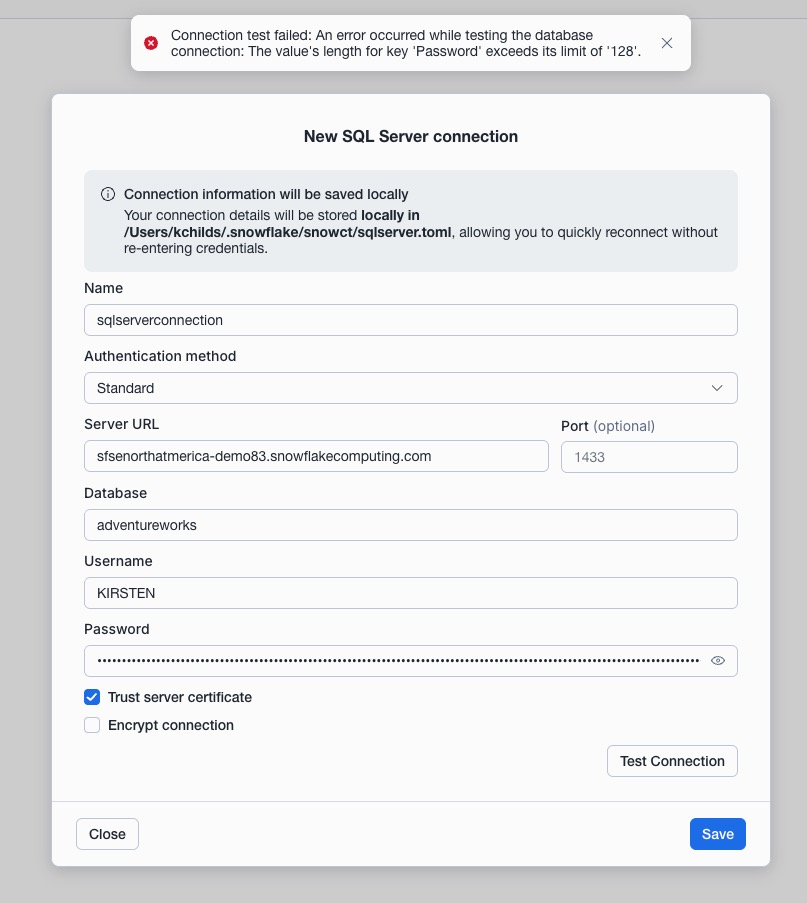


Now that we're all connected and setup for the migration, let's Extract!

---

## Step 2: Extract

From the Project Creation menu, select the blue "GO TO EXTRACTION ->" button in the bottom right corner of the application. This will prompt you to create a connection to a SQL Server account and database.

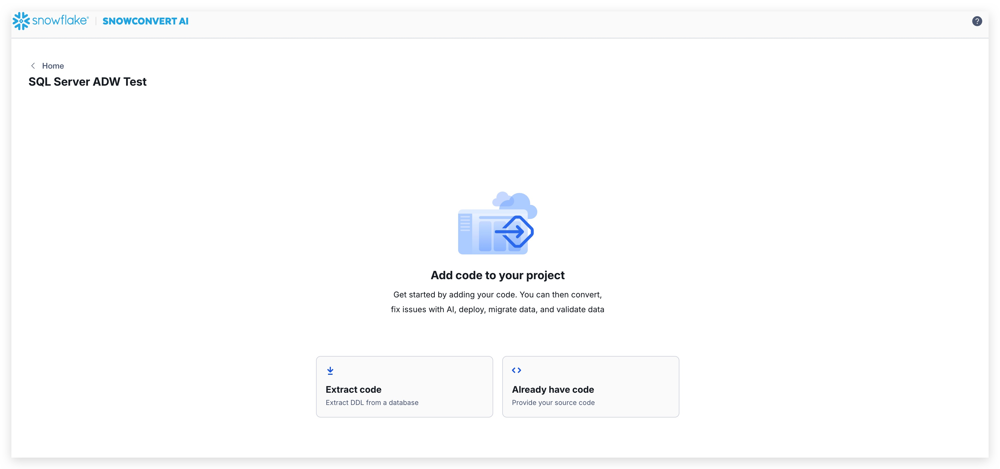

The "From SQL Server" form will launch:

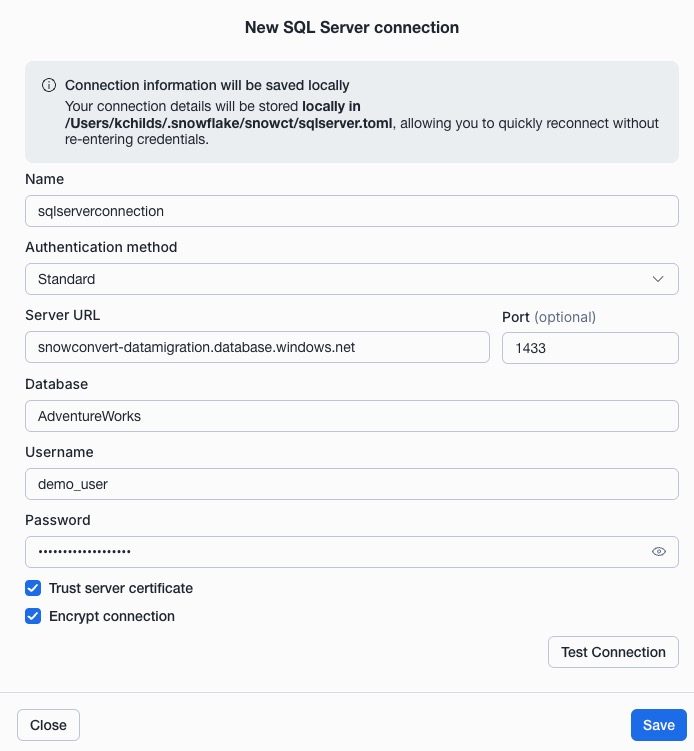

Here is the connection information we're going to use:

- Authentication Method: **Standard**
- Server URL: **snowconvert-datamigration.database.windows.net**
- Database: **AdventureWorks**
- Port: **1433**
- Username: **demo_user**
- Password: **Secure12345!ForDem0**

Check both boxes for "Trust Server Certificate" and "Encrypt Connection".

>If you are unable to connect make sure you are connected to one of the RFT VPN Gateways, the server is only reachable through the full tunnel VPN

Now we will have to specify a local path for our project folder. Anything that we do in SnowConvert will be preserved in this project path as well as anything that is created locally. Choose a path that is fully accessible to you. This is the directory we created before this in the Documents folder and 'SnowConvert. In my case my full project parent folder path is: /Users/damurphy/Documents/Snowconvert/

You will get a pop up that says "Connect Established" when you have connected. SnowConvert will then take you to the catalog screen:

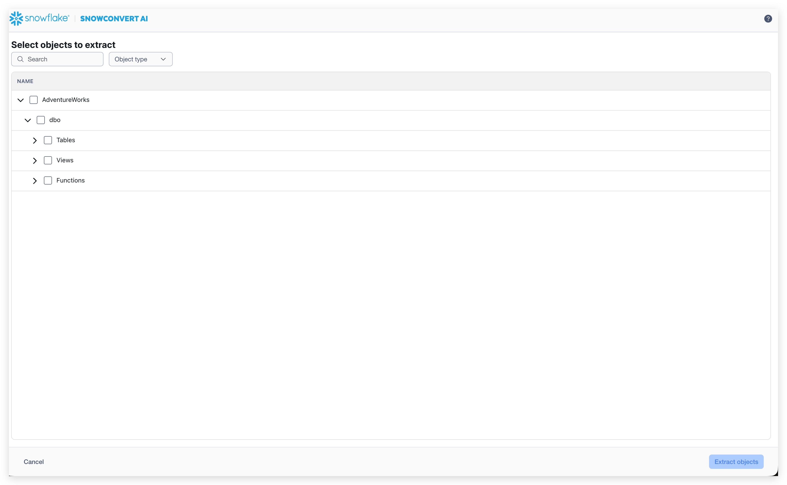

The catalog screen allows you to browse objects that were found in the database. For SQL Server, this could be tables, views, procedures, or functions. Nothing has been converted yet. This is merely an inventory of what SnowConvert found in the source.

Using the catalog, we can select a set of objects for which we'd like to extract the DDL. Using the filter options, you can search for a specific object or set of objects. Using the checkboxes, you can select a specific subset of objects or select the highest checkbox to select everything:

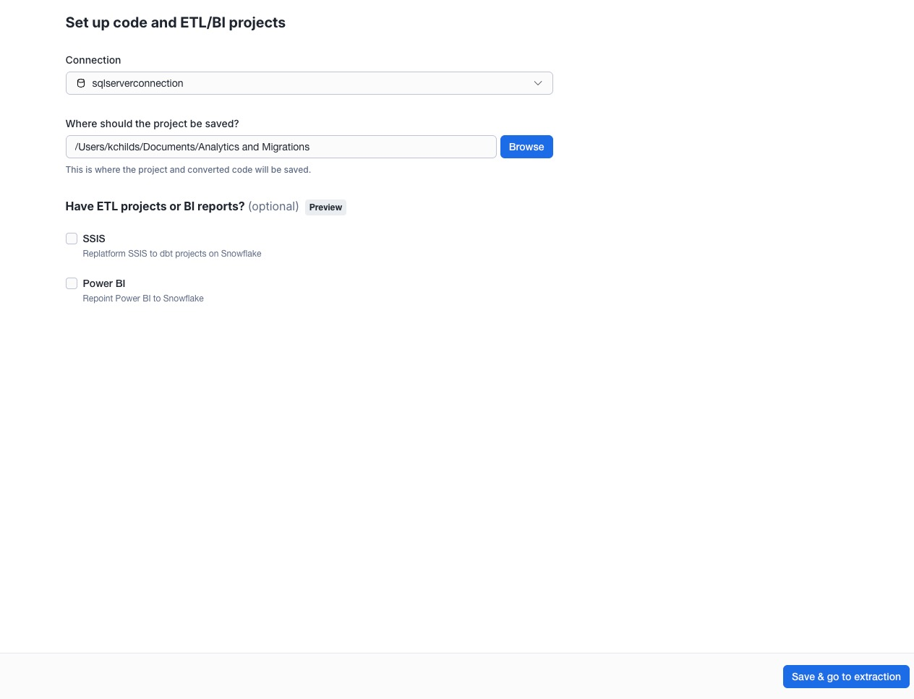

In this example, we will select the top checkbox and select everything. This will include tables, views, and functions. Then select "EXTRACT OBJECTS" to extract the DDL.

This will create a folder on the local machine preserving the structure of the objects in the database with a file for the DDL for each object.

When the extraction is complete, you will see a results screen similar to this:

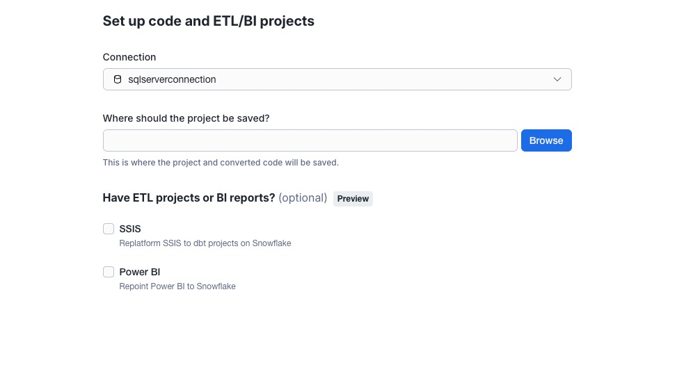

This will give you a brief overview of what was extracted. If there were errors or something was not able to be extracted, it will be reported to you here.

You can select "VIEW EXTRACTED OBJECTS" to see where SnowConvert put the extracted DDL.


But since the number of objects we have extracted matches what we expected and there are no errors, we can **close** this dialog menu and return to the catalog.

Note that now we can see a green checkbox where the DDL was successfully extracted for the object:

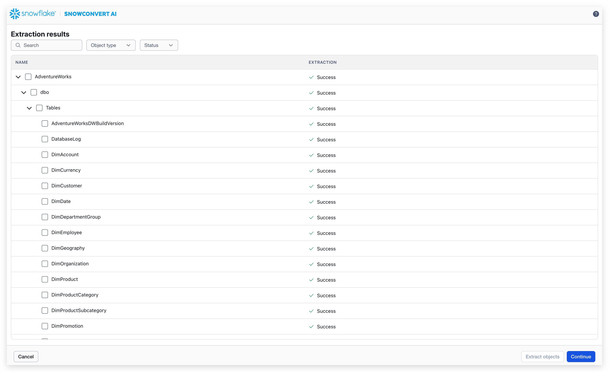

If there was an error extracting the DDL, you would see a red X and would need to resolve why that was not extracted.

Once complete you can click Continue on the bottom right and it will bring you back to the main screen:

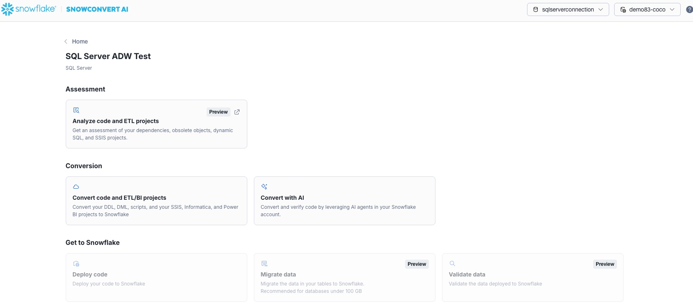

---

## Step 3: Conversion

Moving to the Conversion part lets click on the Convert Code and ETL/BI Projects

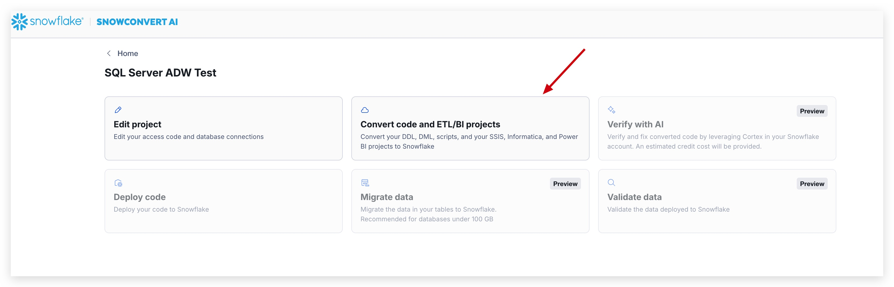

We will use all default settings so lets click 'Use default settings' and click continue

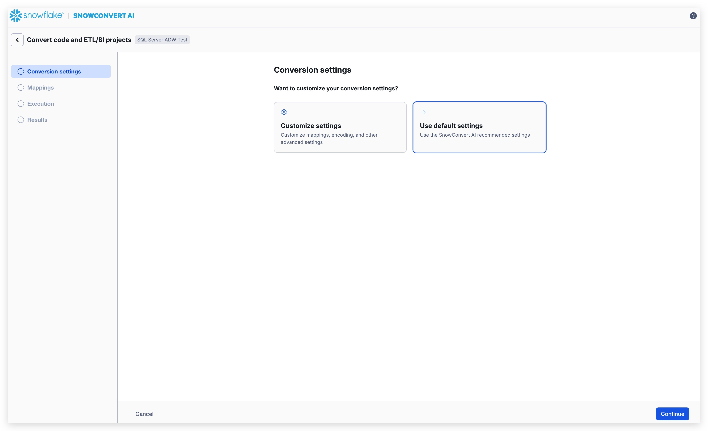

The next screen to come up is the mapping, since we chose defaults it will just name all the objects the same.

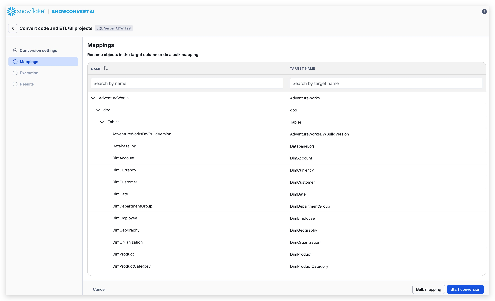

Note that this is completely optional when doing the migration. In this scenario, we will not do any custom mappings. **We will not do this** for the lab, but it is good to know that it is available. At the time of writing this lab, changing object names may have an adverse effect on dependent objects like views. For example, if I change a table name I will have to change the view definition to match the new table name. We plan on catching this in the future but at this time it is not the case.

Since we are leaving our object names unaffected, let's start the conversion process. Select "START CONVERSION" in the bottom right hand corner of the application.

SnowConvert will then execute its conversion engine. This is done by scanning the codebase and creating a semantic model of the source codebase. This model is then used by SnowConvert to create the output Snowflake code as well as the generated reports.

When the conversion is finished, you will see a summary of the results

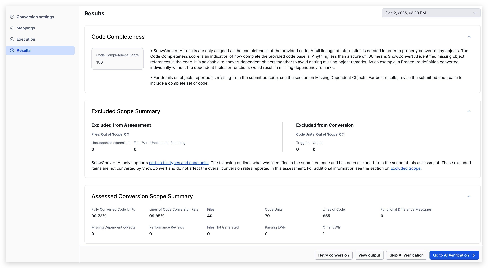

The results page will give you a code completeness score initially, but there is more information below if you scroll down. There is more information on each element of the output report [in the SnowConvert documentation](https://docs.snowconvert.com/sc/general/getting-started/running-snowconvert/review-results), but we'll just highlight a few elements of the report for this lab, and we'll do the followup for each of them which will explore more in depth.

**Code Completeness**: This is a reference to any missing elements or objects that are not present in the codebase. If you have 100% code completeness, then you do not have any missing objects or references to missing elements in the codebase.

Let's visit the additional reports that are generated by SnowConvert. Select "VIEW REPORTS" from the bottom of the application:

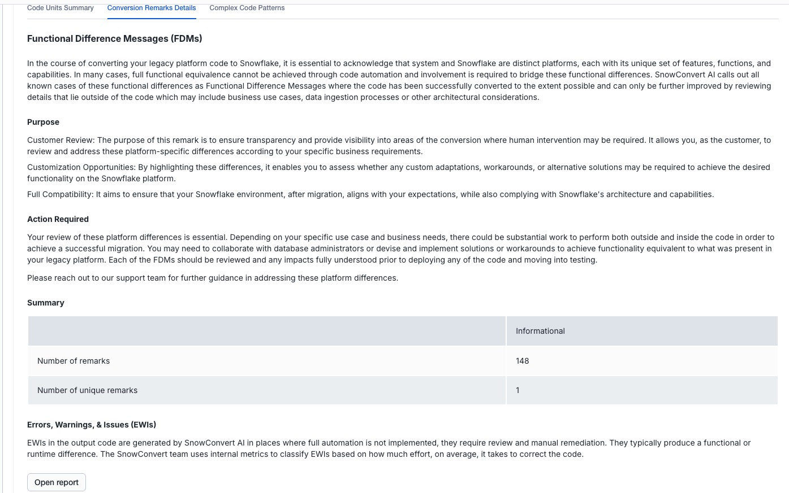

Here we can see all the files generated from the migration including Missing Objects or Issues or Elements. Since this is a demo most files are empty except for the Issues file which has a few items listed:

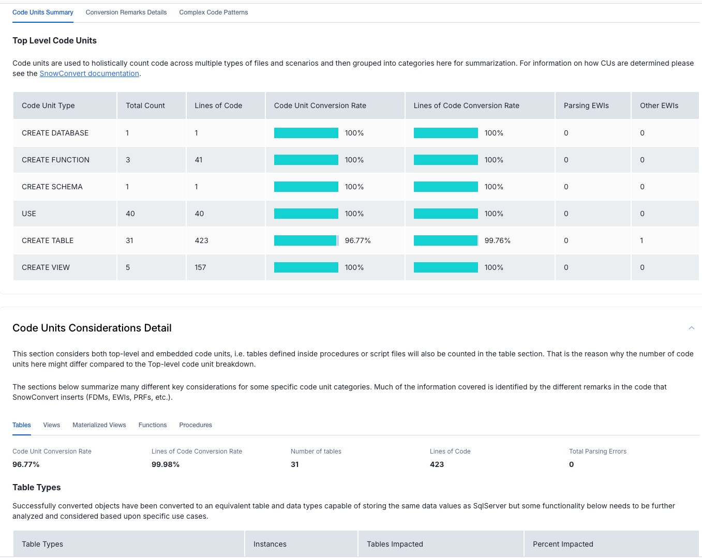

This is the contents of the Issues CSV file for your reference:


In this scenario, we have 100% code completeness. This makes sense given that we are exporting this directly from the source. If you do have missing objects here, the recommendation would be to open the reports folder and validate that the missing objects are either known to be missing or find the DDL for this object.

**Conversion Overview**: Now that we have seen that we have the code that we need for this, let's see how much of our code was converted. Let's review the Code Units Summary section. This section is in the main window just scroll down in the conversion results page:

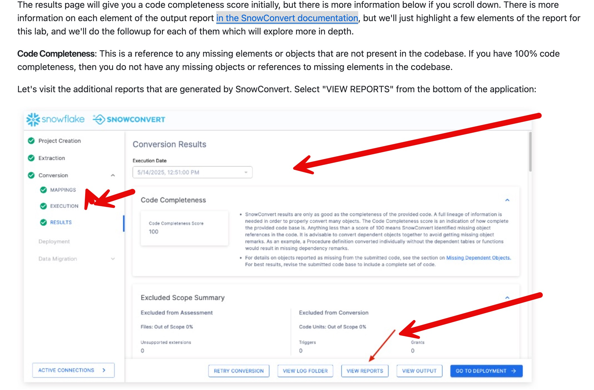

Looks like we have tables, views, and functions in this codebase, but not a lot of code in general (this looks like less than 1000 lines of code in total). There also is only one "EWI's" (in the last column), meaning that the majority of this extracted DDL can be moved over to Snowflake just by using SnowConvert. We'll look through the EWI's in a moment.

Understanding what we have is essential to successfully completing a migration. If we were pre-migration, we would likely stop here and review the object inventory. We'd also want to run the Snowpark Migration Accelerator (SMA) to validate that any pipelines we have include the objects that we are migrating here. In this scenario, we are going to go ahead and move forward to work through any issues that we have and will run the SMA later.

Since we have a good understanding of what needs to be done and it's relatively small, let's go ahead and attack this. Let's resolve the issues that we have present. Before we do that, let's take a look at the status in our object inventory. Select "GO TO AI VERIFICATION" in the application.

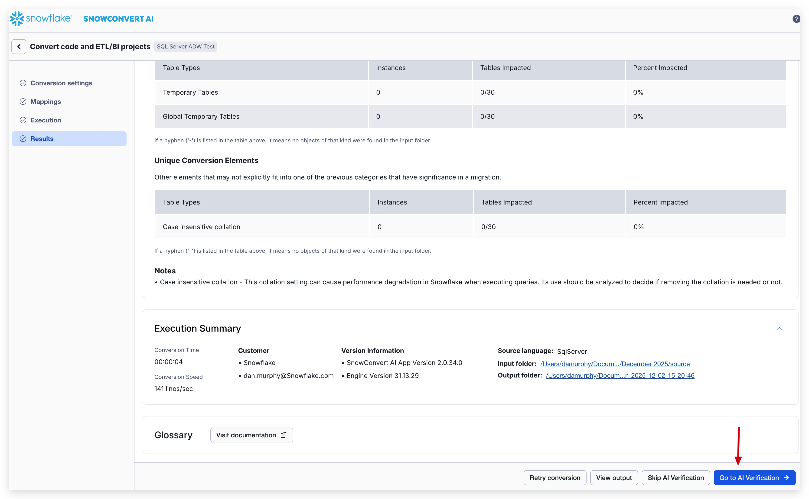

---

## Step 4: AI Verification

> SnowConvert now includes built-in AI Verification, streamlining the lab workflow. Previously, you needed to use a VSCode plugin to request information from Cortex. This can still be found [here](oldpath.md). The VSCode method still works, the new built-in feature eliminates the need to switch between applications. 

Lets go ahead and run the AI Verification in Snowconvert:

First we need to make sure we have our connection to Snowflake setup.  Remember it will also prompt you in Duo be ready for that

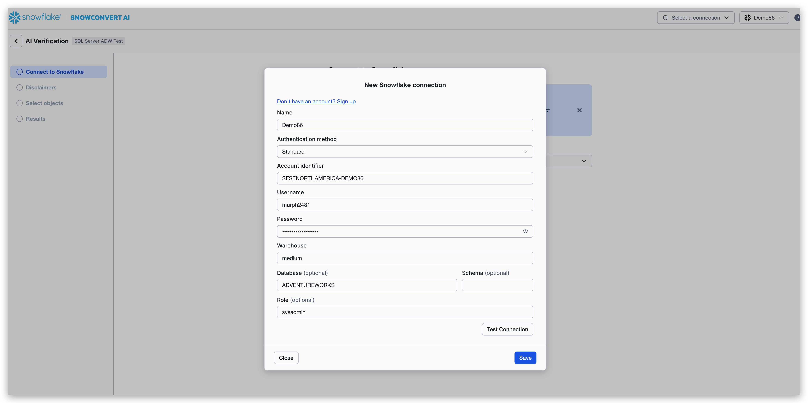

You will then need to accept all disclaimers

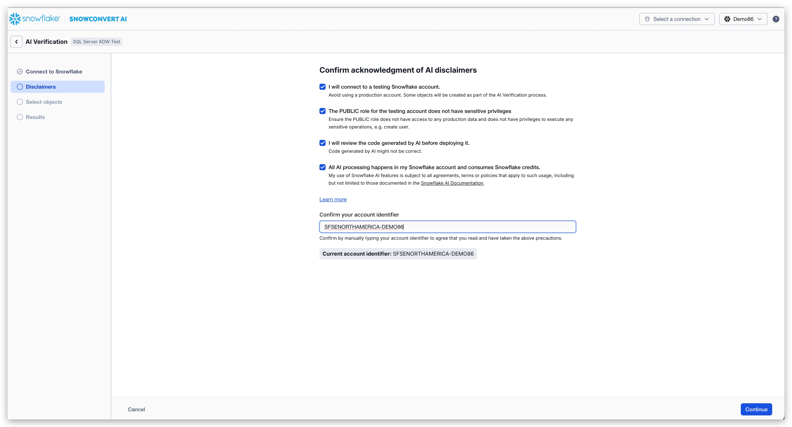

You will then need to select the objects to be checked

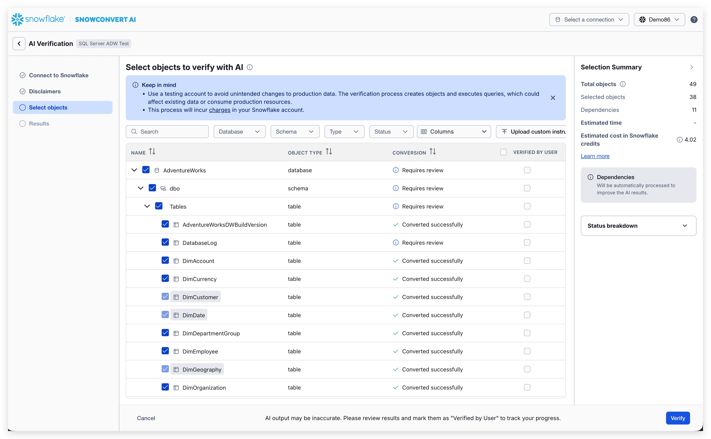

After this runs you will see it running this will take a little bit of time to complete (about 20 mins)

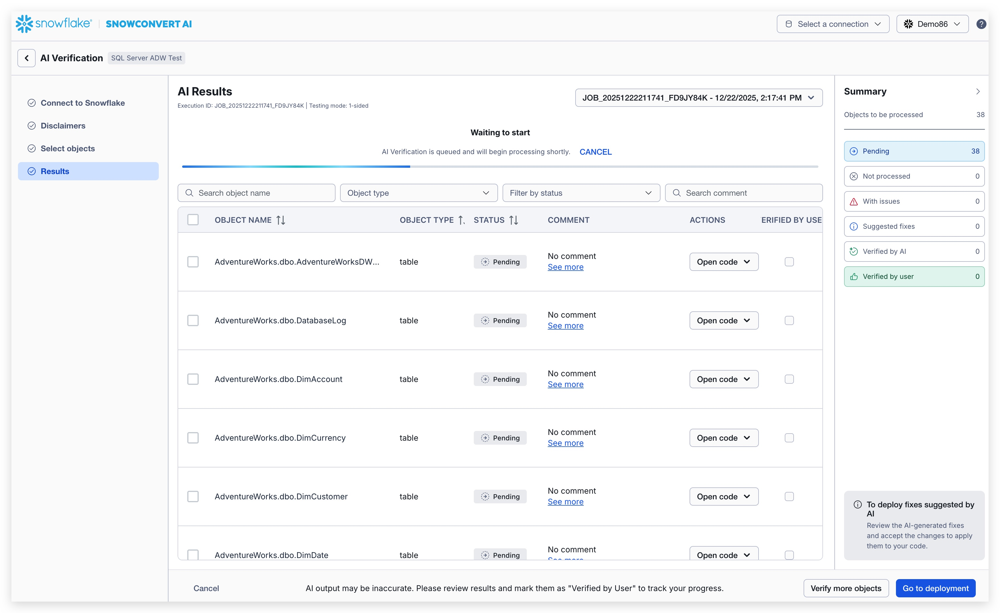

Once complete you will see all the stats and notice a few suggested fixeds by the AI.  Go ahead and filter to see the suggested fixes by the drop down and you will see the three issues it is suggesting to fix

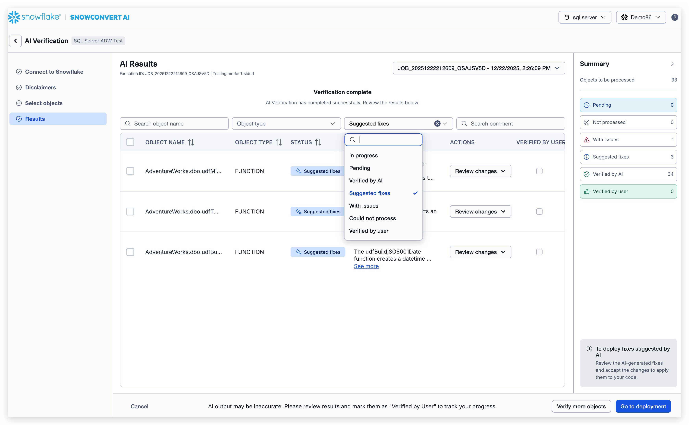

You can then see the detail of the suggestions by clicking on the **see more** link in the comment section.  From there you can review it and accept it if you agree with it.  In this case we will agree with all suggestions:

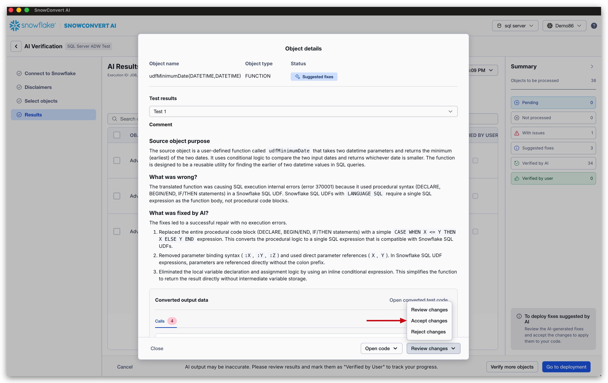

When you have accepted these three suggestions go ahead and click **Go to deployment** on the bottom.

## Step 5: Deploy
Make sure you have your connection information in the Snowflake Connection Section.  This information can easily be found in your connect an app to snowflake section in your account.

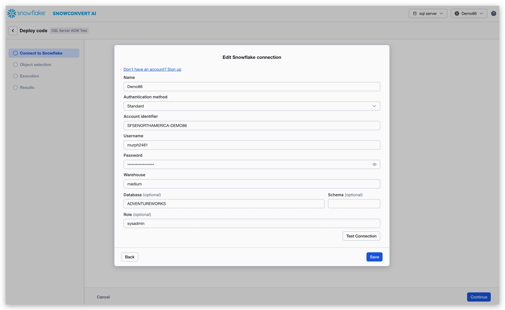

Select all the objects for deployment:

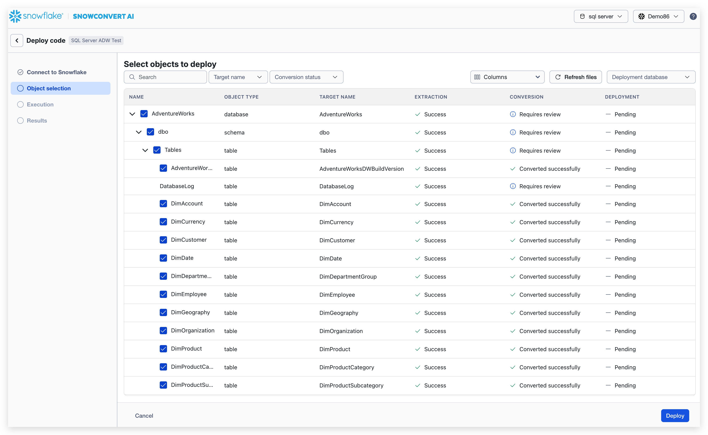

Then the objects will be deployed:

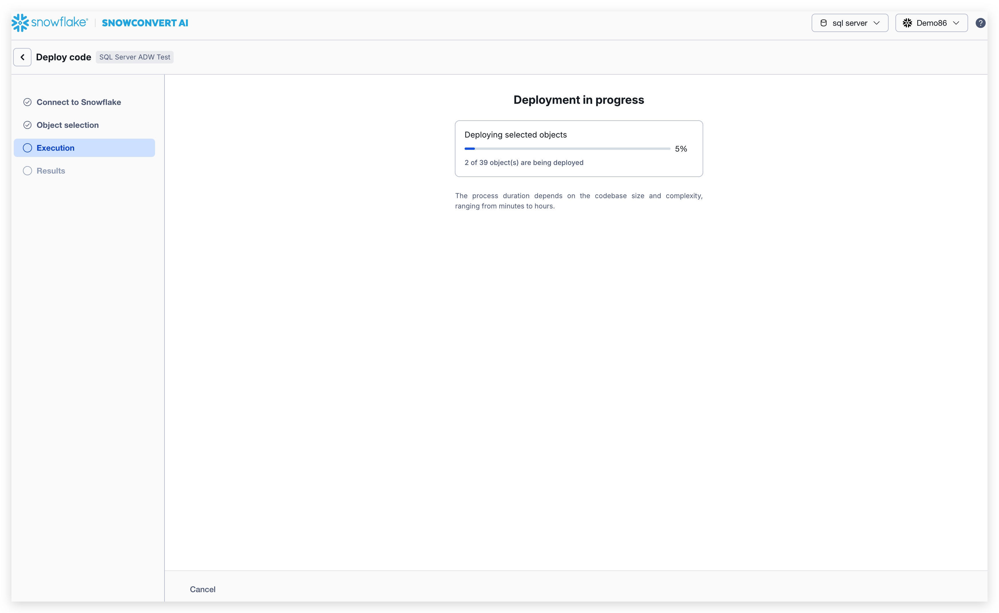

Confirmation will be given on all the objects:

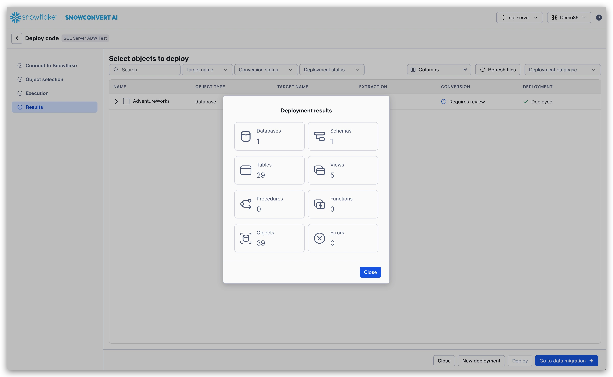

Go ahead and click **go to data migration**

## Step 6: Data Migration
>When you migrate data with SnowConvert it brings the data through the client and then to the source.  This is very inefficient.  It is recommended after you deploy the model you do a batch migration with COPY INTO TABLE from SQL using cloud storage (S3, Azure Blob)

Make sure your source and destination are set in the migration:

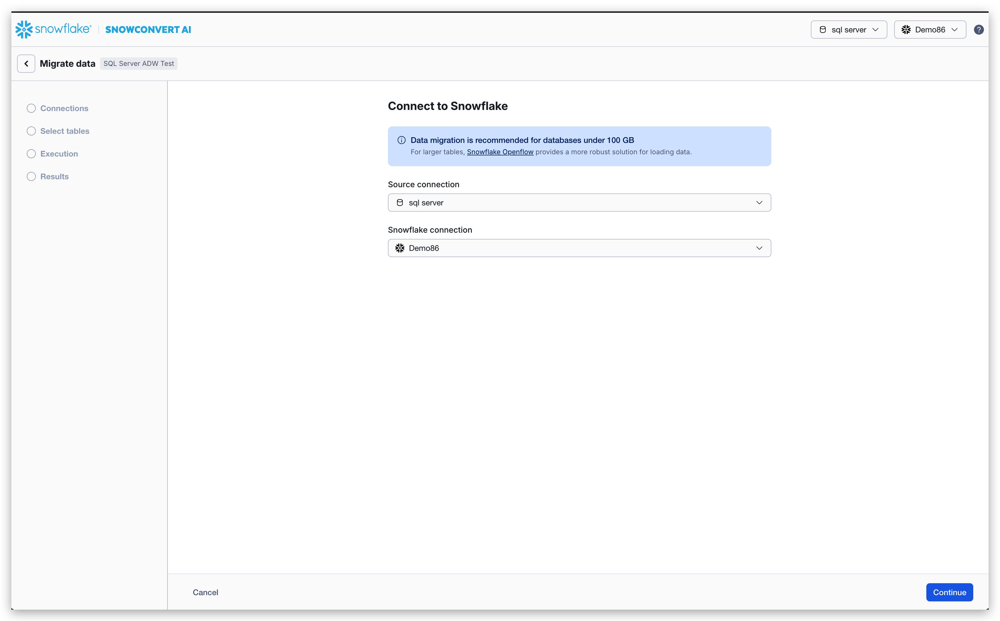

Choose all objects to move

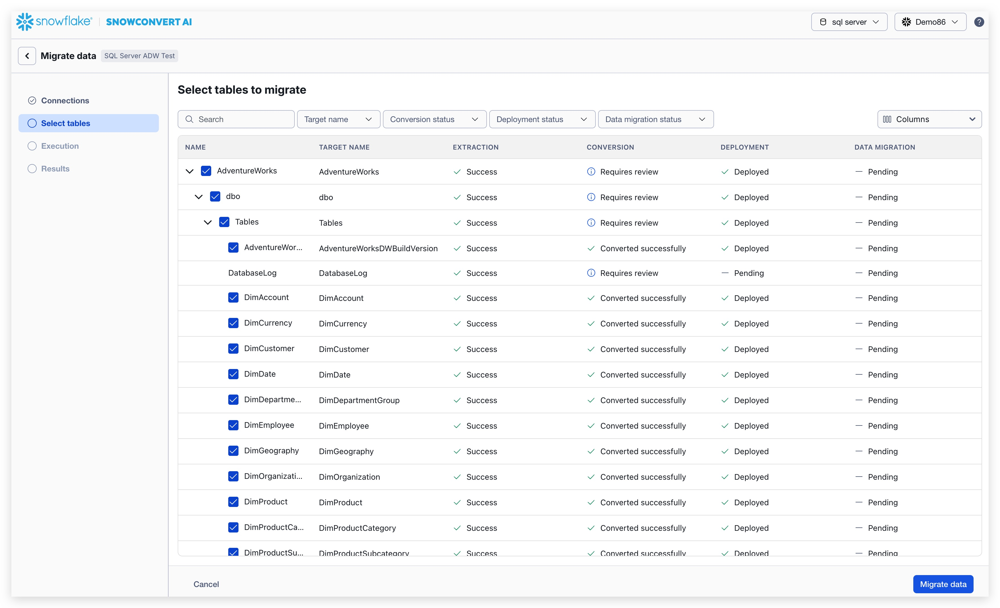

Click **Migrate Data** and this will transfer all the data to the source system.

>If you get an error message on the database log table that is fine and you can ignore it. 

Go to your Snowflake Environment and check to make sure all the objects and data were moved successfully.

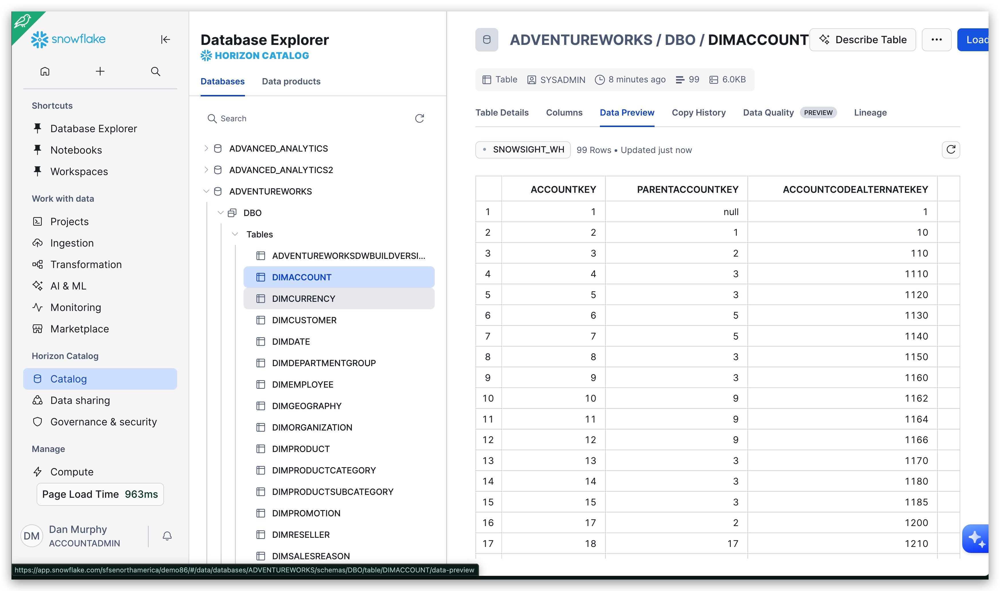


---

## Review

Before we get to our pipelines, let's take a quick look back.

If we review the steps that we did, let's see how they fit in with our migration process:

- Setup our project in SnowConvert
- Extracted the schema from the source database
- Ran SnowConvert's assessment and conversion engine on the extracted schema
- Reviewed the output reporting to better understand what we have
- Reviewed what could not be converted in the VS Code Extension
- Generated new code in the VS Code Extension
- Deployed the code to Snowflake
- Moved the data from the source to Snowflake
- All the while, we were able to track things in our object inventory.

This is what we have just walked through. These steps will generally be recommended regardless of how you used SnowConvert.

And you can generally see that most of these activities fit our **assess** -> **convert** -> **validate** flow:

- Setup our project in SnowConvert **so we can better assess what we have**
- Extracted the schema from the source database **so we can see what kind of DDL we are working with**
- Ran SnowConvert's assessment and conversion engine on the extracted schema **to analyze what we have for our initial assessment, and generate the output converted code**
- Reviewed the output reporting to better understand what we have **to build our assessment of what we have**
- Reviewed what could not be converted in the VS Code Extension **to assess what work needs to be done**
- Generated new code in the VS Code Extension **to resolve any errors in the initial conversion**
- Deployed the code to Snowflake **to validate that the schema works**
- Moved the data from the source to Snowflake **to convert our data into Snowflake data**
- All the while, we were able to track things in our object inventory **to better understand where we are in the migration process**.

---

## Step 6: DORA Grading

**Please only complete this if you are a Snowflake Employee and part of the SE Organization**

### Configure DORA for Grading

1. See code in [/config](/config) to setup DORA and to grade the work that you did and get credit for the lab!
